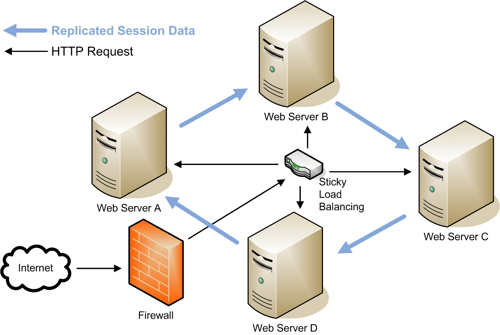

# SqlServer
Aprendizaje de SQL Server desde cero hasta nivel avanzado.


# Bienvenido/a

En el momento de crear ésta documentación de Sql Server, fué necesario pero no indispensable, la versión 2016 de la misma. Así mismo una máquina con SO Windows, de igual forma, los SqlQuery servirán en versiones desde la 2008 en adelante.

## Ilustración


## > 1.- Crear Base De Datos
``` SQL
    create database prueba
```

~~~
Para éste primer ejemplo no es necesario un ejemplo detallado.

#Teoría
//pendiente redacción

#Comandos
Create database (Nombre BD)                   | Comando para crear una base de datos
~~~
➡ Sin archivo doc.mitch

➡ [Enlace del Script.sql](1.-CrearDataBase/1.sql)


> [LICENSE ® ](https://opensource.org/licenses/MIT) 
